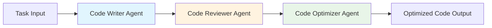

# Claude-Agent: Multi-Agent Code Development Workflow

[](https://www.python.org/downloads/)
[](https://microsoft.github.io/autogen/)
[](https://opensource.org/licenses/MIT)

A sophisticated multi-agent system built with AutoGen 0.4.x that implements a code development workflow using three specialized agents operating in a round-robin fashion.

## 🚀 Overview

This project demonstrates a complete code development pipeline using AI agents:

1. **Code Writer Agent** - Generates initial code based on requirements
2. **Code Reviewer Agent** - Analyzes code and provides optimization suggestions  
3. **Code Optimizer Agent** - Refines code based on original implementation and review feedback

The agents work collaboratively in a round-robin pattern to iteratively improve code quality and functionality.

## 🏗️ System Architecture



## 📋 Prerequisites

- Python 3.9 or higher
- OpenAI API key (for GPT-4 model access)
- Virtual environment (recommended)

## 🛠️ Installation

### 1. Clone the Repository

```bash
git clone https://github.com/Joseph19820124/Claude-Agent.git
cd Claude-Agent
```

### 2. Create Virtual Environment

```bash
python3 -m venv .venv
source .venv/bin/activate  # On Windows: .venv\Scripts\activate
```

### 3. Install Dependencies

```bash
pip install -U "autogen-agentchat" "autogen-ext[openai]"
```

### 4. Environment Setup

Create a `.env` file in the project root:

```env
OPENAI_API_KEY=your_openai_api_key_here
```

Or set the environment variable directly:

```bash
export OPENAI_API_KEY="your_openai_api_key_here"
```

## 🎯 Usage

### Quick Start

```python
import asyncio
from multi_agent_workflow import CodeDevelopmentWorkflow

async def main():
    # Initialize the workflow
    workflow = CodeDevelopmentWorkflow()
    
    # Define your coding task
    task = """
    Create a Python function that calculates the Fibonacci sequence 
    up to n terms using dynamic programming for optimal performance.
    """
    
    # Run the multi-agent workflow
    result = await workflow.run(task)
    print("Final optimized code:", result.final_code)

if __name__ == "__main__":
    asyncio.run(main())
```

### Advanced Usage

```python
# Run with custom configuration
workflow = CodeDevelopmentWorkflow(
    model="gpt-4",  # or "gpt-4o-mini" for cost optimization
    max_rounds=5,   # Maximum conversation rounds
    temperature=0.1 # Lower temperature for more consistent code
)

result = await workflow.run(task, verbose=True)
```

## 📁 Project Structure

```
Claude-Agent/
├── README.md
├── requirements.txt
├── .env.example
├── multi_agent_workflow.py    # Main workflow implementation
├── agents/
│   ├── __init__.py
│   ├── code_writer.py         # Code Writer Agent
│   ├── code_reviewer.py       # Code Reviewer Agent
│   └── code_optimizer.py      # Code Optimizer Agent
├── examples/
│   ├── basic_example.py       # Simple usage example
│   ├── advanced_example.py    # Advanced configuration example
│   └── fibonacci_example.py   # Fibonacci implementation example
├── tests/
│   ├── __init__.py
│   ├── test_workflow.py       # Workflow tests
│   └── test_agents.py         # Individual agent tests
└── docs/
    ├── agent_documentation.md  # Detailed agent documentation
    └── api_reference.md        # API reference guide
```

## 🔧 Configuration

### Model Configuration

The system supports various OpenAI models:

```python
# Cost-effective option
model_client = OpenAIChatCompletionClient(model="gpt-4o-mini")

# High-performance option  
model_client = OpenAIChatCompletionClient(model="gpt-4")

# Latest model with enhanced capabilities
model_client = OpenAIChatCompletionClient(model="gpt-4o")
```

### Termination Conditions

Customize when the workflow should stop:

```python
from autogen_agentchat.conditions import MaxMessageTermination, TextMentionTermination

# Stop after maximum messages or when "COMPLETE" is mentioned
termination = (
    MaxMessageTermination(max_messages=15) | 
    TextMentionTermination("COMPLETE")
)
```

## 📖 Examples

### Example 1: Fibonacci Sequence

```python
task = """
Create a Python function that calculates the Fibonacci sequence 
up to n terms using dynamic programming for optimal performance.
Include input validation and comprehensive docstring.
"""
```

### Example 2: Data Processing

```python
task = """
Write a Python class for processing CSV files that can:
1. Read large CSV files efficiently
2. Filter data based on multiple criteria
3. Export results to different formats (JSON, Excel)
4. Handle missing values gracefully
"""
```

### Example 3: API Client

```python
task = """
Create a robust HTTP API client class that includes:
- Automatic retry logic with exponential backoff
- Request/response logging
- Authentication handling
- Rate limiting
- Comprehensive error handling
"""
```

## 🧪 Testing

Run the test suite:

```bash
# Run all tests
python -m pytest tests/

# Run specific test file
python -m pytest tests/test_workflow.py -v

# Run with coverage
python -m pytest tests/ --cov=. --cov-report=html
```

## 📊 Performance Metrics

The system tracks various metrics:

- **Code Quality Score**: Based on complexity, readability, and best practices
- **Review Coverage**: Percentage of code reviewed and optimized
- **Execution Time**: Total time for the workflow completion
- **Token Usage**: API token consumption for cost tracking

## 🔍 Agent Specifications

### Code Writer Agent
- **Role**: Initial code generation based on requirements
- **Capabilities**: 
  - Multi-language code generation
  - Best practices implementation
  - Documentation generation
- **Output**: Functional code with basic structure

### Code Reviewer Agent  
- **Role**: Code analysis and improvement suggestions
- **Capabilities**:
  - Static code analysis
  - Performance optimization suggestions
  - Security vulnerability detection
  - Code style and convention checking
- **Output**: Detailed review with specific recommendations

### Code Optimizer Agent
- **Role**: Code refinement and final implementation
- **Capabilities**:
  - Performance optimization
  - Code refactoring
  - Integration of review suggestions
  - Final quality assurance
- **Output**: Production-ready optimized code

## 🤝 Contributing

We welcome contributions! Please see our [Contributing Guidelines](CONTRIBUTING.md) for details.

### Development Setup

```bash
# Install development dependencies
pip install -U "autogen-agentchat" "autogen-ext[openai]" pytest black flake8 mypy

# Run code formatting
black .

# Run linting
flake8 .

# Run type checking
mypy .
```

## 📝 License

This project is licensed under the MIT License - see the [LICENSE](LICENSE) file for details.

## 🙏 Acknowledgments

- [Microsoft AutoGen](https://github.com/microsoft/autogen) - The amazing multi-agent framework
- [OpenAI](https://openai.com/) - GPT models powering the agents
- AutoGen Community - For continuous improvements and support

## 📞 Support

- **GitHub Issues**: [Report bugs or request features](https://github.com/Joseph19820124/Claude-Agent/issues)
- **Discussions**: [Community discussions](https://github.com/Joseph19820124/Claude-Agent/discussions)
- **Documentation**: [Full documentation](docs/)

## 🚧 Roadmap

- [ ] Support for additional LLM providers (Anthropic Claude, Google Gemini)
- [ ] Web-based UI for workflow visualization
- [ ] Integration with popular IDEs
- [ ] Advanced code metrics and analytics
- [ ] Multi-language support beyond Python
- [ ] Docker containerization
- [ ] CI/CD pipeline integration

---

⭐ **Star this repository if you find it useful!**

📧 **Questions?** Feel free to [open an issue](https://github.com/Joseph19820124/Claude-Agent/issues) or start a [discussion](https://github.com/Joseph19820124/Claude-Agent/discussions).

*Last updated: May 23, 2025*